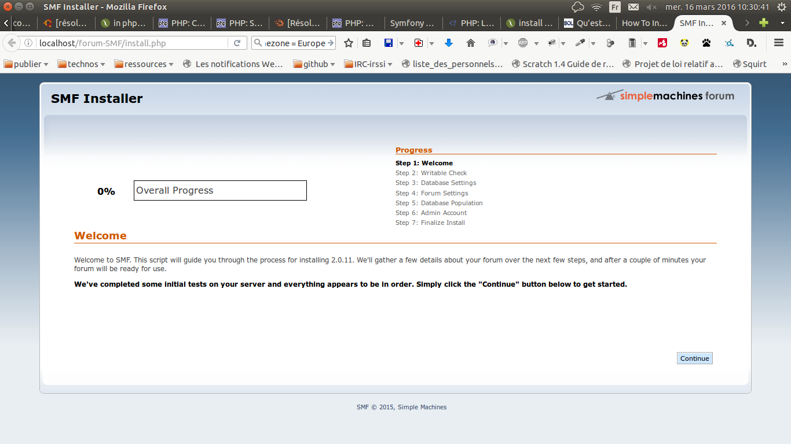
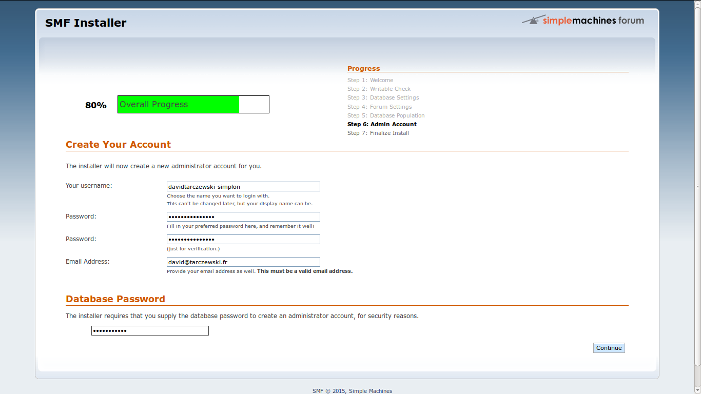
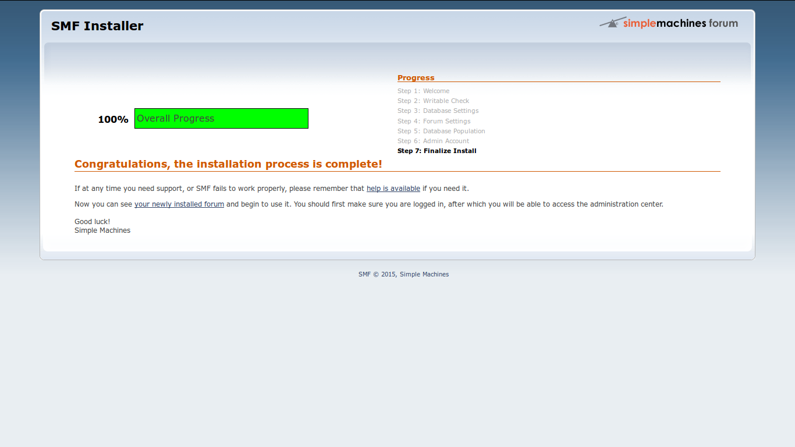

#Comment installer [Simple Machine FORUM](http://www.simplemachines.org/)
##en ligne de commande

>téléchargement de l'archive du CMS :

`wget http://download.simplemachines.org/index.php/filename=smf_2-0-11_install.tar.bz2`

>on vérifie que c'est bien installé :

`ll`

>on crée un dossier/repo/ dans lequel le forum ira se décompresser :

`mkdir smf`

>on décompresse l'archive dedans :

`tar -xvf smf_2-0-11_install.tar.bz2 -C smf/`

>maintenant ouvrez votre navigateur à l'adresse d'installation

>exemple : localhost/Dossier_de_l_archive/smf/install.php

>Vous allez avoir un script qui va vous aider à installer SMF...

>au moment de changer les droits, vous pouvez revenir en ligne de commmande :

`sudo chmod a+w -R attachments avatars cache Packages Packages/installed.list Smileys Themes agreement.txt Settings.php Settings_bak.php`

>puis enfin, renommez, ou supprimez le fichier d'installation :

`mv install.php install_bak.php`

Retrouvez toutes ces infos et bien plus [sur cette page d'explication de Simple Machine Forum](http://wiki.simplemachines.org/smf/Installing)
